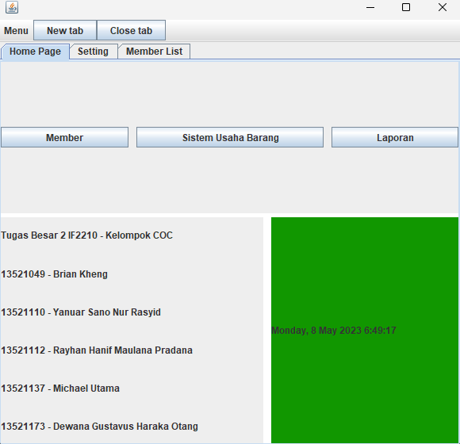
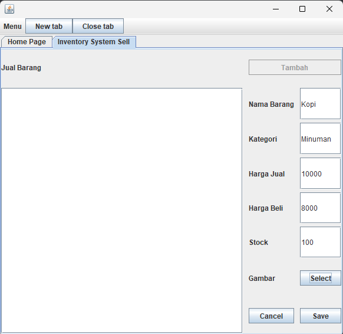
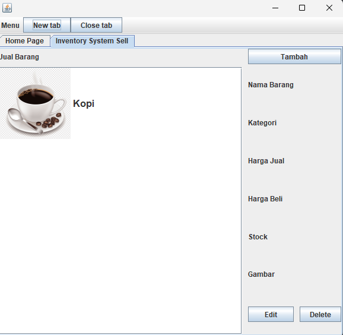
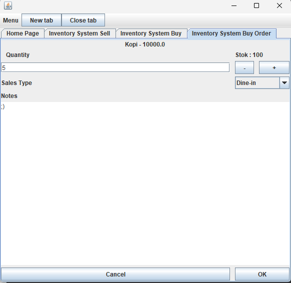
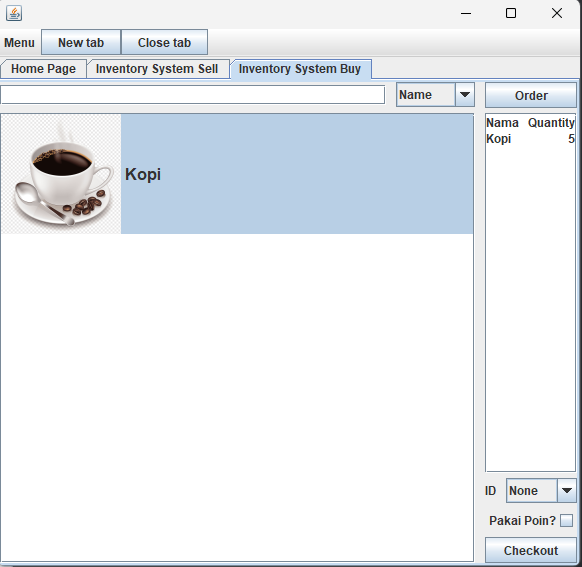
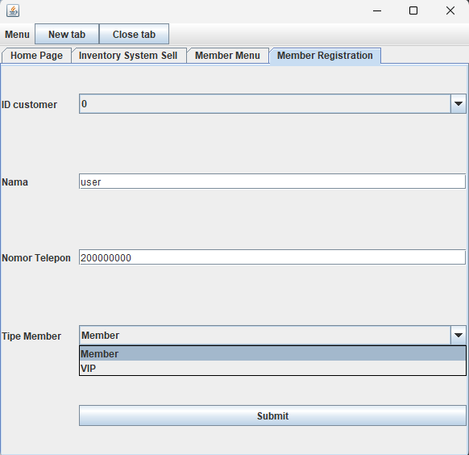
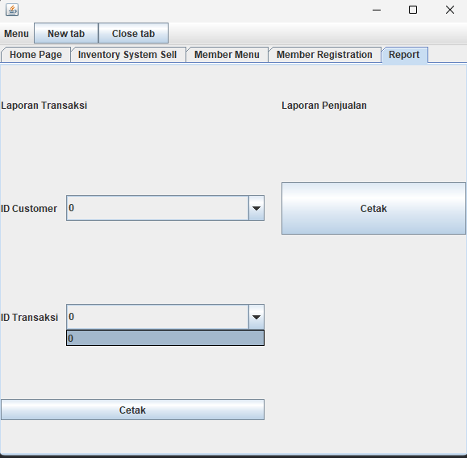
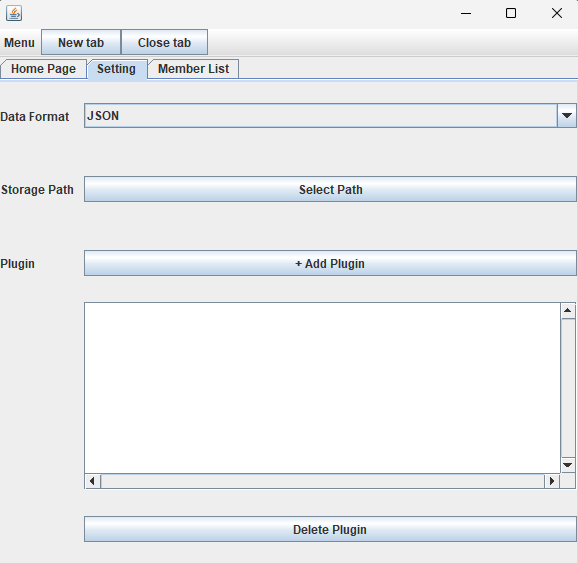
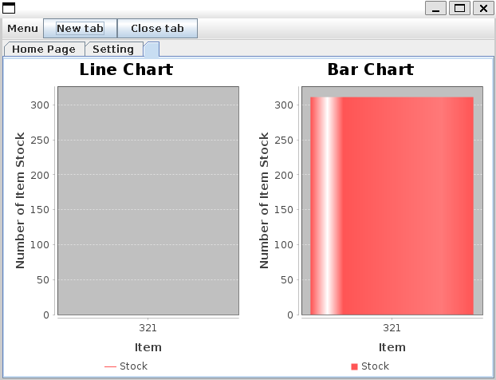

# Tubes2_IF2210_COC

Implementasi Point of Sales (POS) dengan konsep Pemrograman Berorientasi Objek menggunakan bahasa Java

## Point of Sales

> Program ini dibuat untuk mengimplementasi konsep object oriented programming untuk membuat sebuah program Point of Sales (POS) program yang membantu sebuah toko untuk melakukan dan mencatat transaksi yang berhubungan dengan usaha.
> Program POS memiliki fitur dasar manajemen inventaris dan manajemen transaksi. Selain itu, program memiliki fitur membership untuk memberikan reward kepada pelanggan yang setia, dan juga fitur pembuatan laporan untuk mendukung toko dalam melakukan evaluasi. Program juga bersifat extensible dengan menyediakan dukungan plugin, sehingga pengguna dapat menambahkan fungsionalitas program dengan mudah.

Konsep OOP yang digunakan

1. Inheritance
2. Composition
3. Interface
4. Polymorphism
5. Method Overriding dan Method Overloading
6. Java API Collection
7. Prinsip S.O.L.I.D.
8. Design Pattern
9. Reflection
10. Threading

## Table of Contents

- [Tubes2\_IF2210\_COC](#tubes2_if2210_coc)
  - [Point of Sales](#point-of-sales)
  - [Table of Contents](#table-of-contents)
  - [Setup](#setup)
  - [Usage](#usage)
  - [Pemakaian program](#pemakaian-program)
  - [Project Status](#project-status)

## Setup

Program membutuhkan Java versi 1.8 beserta maven untuk mempermudah kompilasi.
Untuk referensi instalasi bisa mengunjungi link berikut

Java

<https://www.java.com/en/download/help/windows_manual_download.html>

Maven

<https://maven.apache.org/install.html>

## Usage

Cara kompilasi program

1. Clone repository

   ```bash
      git clone https://github.com/Michaelu670/Tubes2_IF2210_COC.git
   ```

2. Kompilasi menjadi jar file menggunakan Maven

    ```bash
      cd Tubes2_IF2210_COC
      mvn package
    ```

File jar akan ada berada pada folder target.

Program dapat dijalankan dengan menggunakan command `java -jar` ditambah dengan nama file jar (dengan dependencies) yang sudah dibuat atau yang ada pada folder bin.

Contoh

```bash
    java -jar ./target/Tubes2_IF2210_COC-1.0-SNAPSHOT-jar-with-dependencies.jar
```

## Pemakaian program

Saat menjalankan program, user akan ditambilkan dengan halaman utama.



Pada halaman ini user dapat memilih fitur yang ingin diakses.

Fitur-fitur tersebut adalah

1. Sistem Usaha Barang

    Terdapat dua menu yaitu `jual barang` dan `beli barang`.

    Pada fitur jual barang, pengguna dapat memasukkan barang yang ingin dijual dengan mengisi semua field yang diperlukan.
    Menambah barang dengan menekan tombol `Tambah` kemudian dapat mengubah barang atau menghapus barang dengan menekan barang tersebut kemudian menekan tombol `Edit` atau `Delete`.

    

    

    Setelah barang terdaftar. Pengguna dapat menjual barang tersebut dengan memilih menu beli barang. Pengguna dapat memilih berapa banyak yang ingin dibeli, tipe pembelian, dan catatan jika perlu. Untuk memulai memesan menekan tombol `order` dan jika sudah dibayar tekan tombol `checkout`.

    

    

2. Fitur Membership

    Pada menu member terdapat tiga menu yaitu `Registration`, `List`, dan `History`

    Seseorang yang sudah pernah membeli dapat mendaftar menjadi membership pada halaman `Registration`. Pendaftaran dilakukan dengan memilih ID, memasukkan nama, nomor telepon, dan memilih jenis member.

    

    Pengguna dapat melihat semua member yang sudah terdaftar pada halaman `List`. Pada halaman ini juga pengguna dapat mengedit nama, nomor telepon, status keaktifan, dan jenis member dari seluruh member yang sudah terdaftar.

    Pengguna dapt melihat sejarah pembeliah dari tiap user pada halaman `History`.

3. Fitur Report

    Pada menu report pengguna dapat mencetak semua transkasi yang pernah terjadi melalui aplikasi dengan memilih tombol cetak pada bagian `Laporan Penjualan`
    Atau Pengguna dapat memasukkan id seorang user dan id transaksi-nya yang nanti akan dicetak pada bagian `Laporan Transaksi`

    

4. Fitur Setting

    Pada menu tab ini pengguna dapat memilih data format penyimpanan data dari aplikasi ini serta tempat penyimpanannya.

    

    Selain itu, tab ini juga menyediakan tempat untuk memasukkan plugin untuk menambah fungsionalitas program seperti plugin yang menampilkan chart dari data aplikasi.

    

## Project Status

 Disusun Oleh :

- 13521049 / Brian Kheng
- 13521110 / Yanuar Sano Nur Rasyid
- 13521112 / Rayhan Hanif Maulana Pradana
- 13521137 / Michael Utama
- 13521173 / Dewana Gustavus Haraka Otang

Project is: _ongoing_